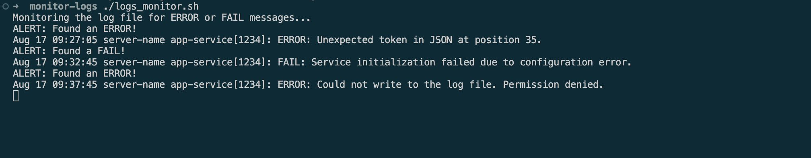

# Log File Monitor Script

This is a Bash script to help monitor log files for any occurrences of "ERROR" or "FAIL". If the script detects either of these keywords, it will immediately alert you by printing a message to the terminal along with the log entry that triggered the alert.

## What You'll Need

- A Bash shell
- A log file to monitor (I'm using one called `systems.log` in this example).

## Steps Followed
1. **Grab the Script**: First, download or clone this repository to your computer.

2. **Check the Log File Path**: By default, the script is set up to monitor a file located in the same repository called `systems.log`. If your log file has a different name or location, you'll need to update the script. Just open it up and change the `LOG_FILE` variable to match your file's name or path.

    For example, if your log file is named differently, you would change:

    ```bash
    LOG_FILE="./systems.log"
    ```

3. **Make the script executable**. Run the following command in your terminal:

    ```bash
    chmod +x logs_monitor.sh
    ```

4. **Run the script**. You can start monitoring the log file by running:

    ```bash
    ./logs_monitor.sh
    ```

    The script will now continuously monitor the log file for any lines containing "ERROR" or "FAIL". If it finds any, it will print an alert message to the terminal.

## Example Output

When the script detects an "ERROR" or "FAIL" in the log file, it will output something like this:

